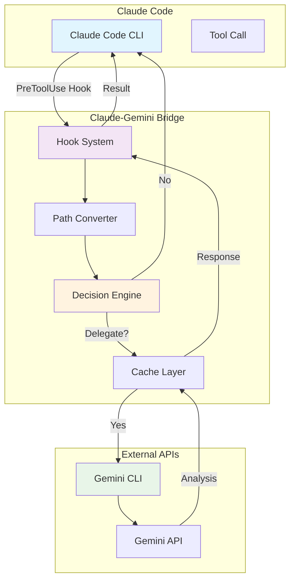
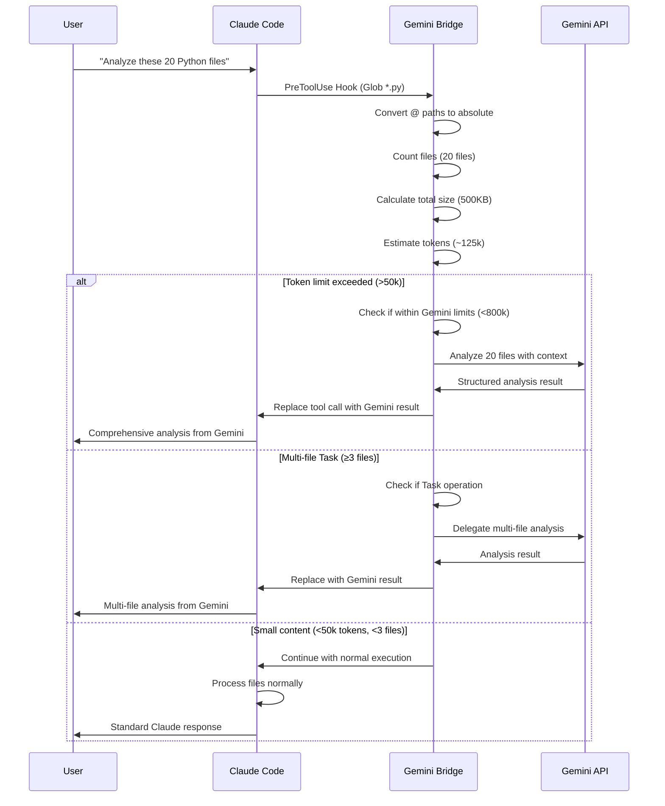
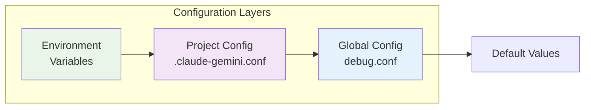
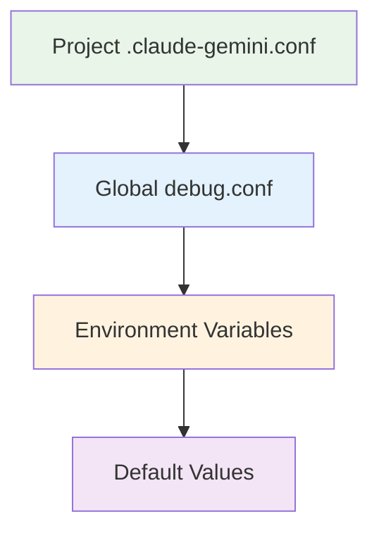
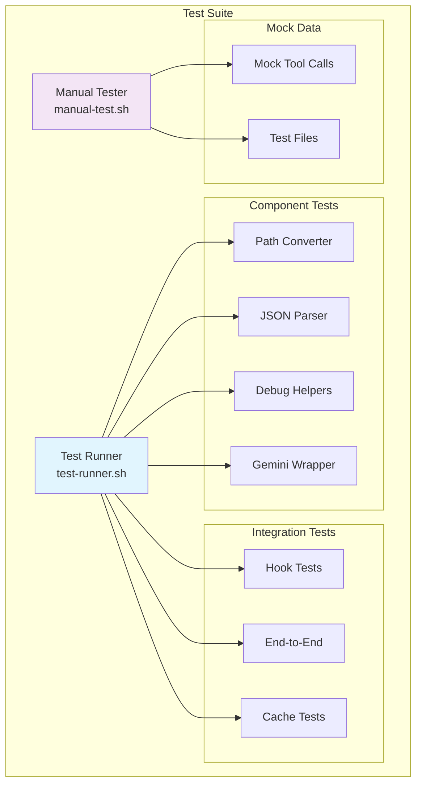
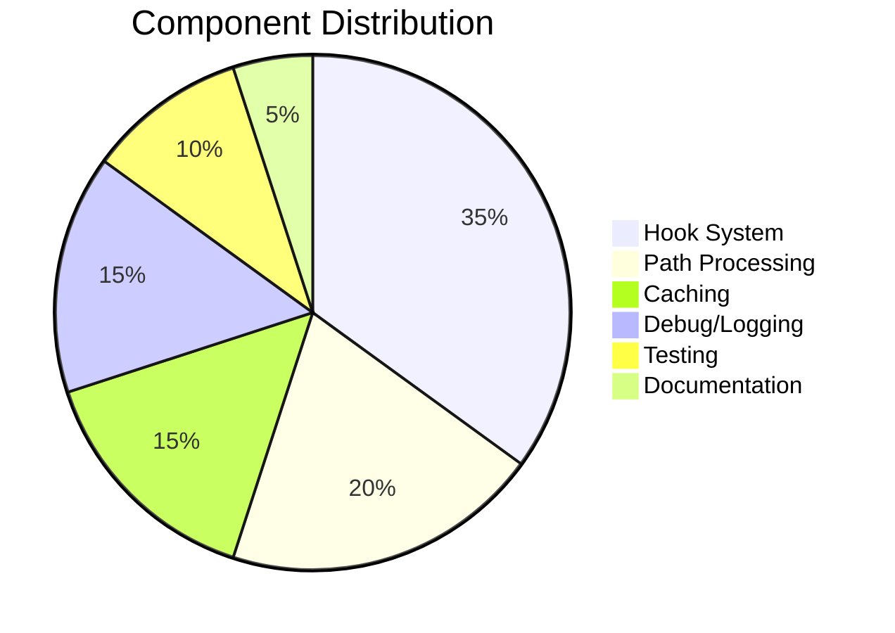

# Claude-Gemini Bridge

🤖 **Intelligent integration between Claude Code and Google Gemini for large-scale code analysis**

The Claude-Gemini Bridge automatically delegates complex code analysis tasks from Claude Code to Google Gemini, combining Claude's reasoning capabilities with Gemini's large context processing power.

[](#testing)
[](#license)
[](#requirements)

## 🚀 Quick Start

```bash
# Clone and install for all projects in one simple process
git clone https://github.com/your-username/claude-gemini-bridge.git
cd claude-gemini-bridge
./install.sh

# IMPORTANT: Restart Claude Code to load the new hooks
# (Hooks are only loaded once at startup)

# Test the installation
./test/test-runner.sh

# Use Claude Code normally - large analyses will automatically use Gemini!
claude "analyze all Python files in this project"
```

### Installation Details

The installer:
- ✅ Works in the current directory (no separate installation location)
- ✅ Automatically merges with existing Claude hooks in `~/.claude/settings.json`
- ✅ Creates backups before making changes
- ✅ Tests all components during installation
- ✅ Provides uninstallation via `./uninstall.sh`

## 📋 Table of Contents

- [Architecture](#-architecture)
- [How It Works](#-how-it-works)
- [Installation](#-installation)
- [Configuration](#-configuration)
- [Usage Examples](#-usage-examples)
- [Testing](#-testing)
- [Troubleshooting](#-troubleshooting)
- [Contributing](#-contributing)

## 🏗️ Architecture



## 🔄 How It Works

The bridge operates through Claude Code's hook system, intelligently deciding when to delegate tasks to Gemini:



### Delegation Criteria

The bridge delegates to Gemini when:

- **Token Limit**: Content exceeds ~50k tokens (~200KB, optimized for Claude's 200k context)
- **Multi-File Tasks**: ≥3 files for Task operations (configurable)
- **Safety Limits**: Content must be ≤10MB and ≤800k tokens for Gemini processing
- **File Exclusions**: Automatically excludes sensitive files (*.secret, *.key, *.env, etc.)

## 📦 Installation

### Prerequisites

- [Claude Code CLI](https://claude.ai/code) installed and configured
- [Google Gemini CLI](https://github.com/google/generative-ai-cli) installed
- `jq` for JSON processing
- `bash` 4.0+ (macOS: `brew install bash`)

### Installation Options

The Claude-Gemini Bridge supports two deployment models:

#### 🌍 Global Installation (Recommended)

For system-wide use across all projects:

```bash
# Clone to a permanent location
git clone https://github.com/your-username/claude-gemini-bridge.git ~/claude-gemini-bridge
cd ~/claude-gemini-bridge
./install.sh

# IMPORTANT: Restart Claude Code after installation!
```

**Benefits:**
- ✅ Works with all projects automatically
- ✅ Single configuration location
- ✅ Easier maintenance and updates
- ✅ Hooks registered in `~/.claude/settings.json`

#### 📁 Project-Specific Installation

For use within a specific project directory:

```bash
# Clone into your project
cd /path/to/your/project
git clone https://github.com/your-username/claude-gemini-bridge.git .claude-gemini
cd .claude-gemini
./install.sh

# Project-specific configuration
echo "MIN_FILES_FOR_GEMINI=2" > .claude-gemini.conf
echo "GEMINI_TIMEOUT=60" >> .claude-gemini.conf
```

**Benefits:**
- ✅ Project-specific settings via `.claude-gemini.conf`
- ✅ Different thresholds per project
- ✅ Team-shareable configuration
- ✅ Isolated from other projects

The installer automatically:
- ✅ Checks all prerequisites
- ✅ Tests Gemini connectivity  
- ✅ Backs up existing Claude settings
- ✅ Intelligently merges hooks into `~/.claude/settings.json`
- ✅ Sets up directory structure and permissions
- ✅ Runs validation tests

### Manual Installation

<details>
<summary>Click to expand manual installation steps</summary>

1. **Clone the repository:**
   ```bash
   git clone https://github.com/your-username/claude-gemini-bridge.git
   cd claude-gemini-bridge
   ```

2. **Set up directory structure:**
   ```bash
   # Files are already in the right place after git clone
   chmod +x hooks/*.sh
   mkdir -p cache/gemini logs/debug debug/captured
   ```

3. **Configure Claude Code hooks:**
   ```bash
   # Add to ~/.claude/settings.json
   {
     "hooks": {
       "PreToolUse": [{
         "matcher": "Read|Grep|Glob|Task",
         "hooks": [{
           "type": "command",
           "command": "/full/path/to/claude-gemini-bridge/hooks/gemini-bridge.sh"
         }]
       }]
     }
   }
   ```

</details>

## ⚙️ Configuration

### Complete Configuration Reference

Edit `hooks/config/debug.conf` in your installation directory:

```bash
# Debug configuration
DEBUG_LEVEL=2                    # 0=off, 1=basic, 2=verbose, 3=trace
CAPTURE_INPUTS=true              # Save hook inputs for analysis
MEASURE_PERFORMANCE=true         # Enable timing measurements
DRY_RUN=false                   # Test mode without Gemini calls

# Delegation thresholds (optimized for Claude 200k context)
MIN_FILES_FOR_GEMINI=3          # Delegate Task operations with ≥3 files
MIN_FILE_SIZE_FOR_GEMINI=5120   # Minimum 5KB total size (was 10KB)
MAX_TOTAL_SIZE_FOR_GEMINI=10485760  # Maximum 10MB total size

# Gemini API settings
GEMINI_CACHE_TTL=3600           # Cache responses for 1 hour
GEMINI_RATE_LIMIT=1             # 1 second between API calls
GEMINI_TIMEOUT=30               # 30 second API timeout
GEMINI_MAX_FILES=20             # Maximum files per Gemini call

# File security (never sent to Gemini)
GEMINI_EXCLUDE_PATTERNS="*.secret|*.key|*.env|*.password|*.token|*.pem|*.p12"

# Automatic maintenance
AUTO_CLEANUP_CACHE=true         # Enable cache cleanup
CACHE_MAX_AGE_HOURS=24          # Clean cache older than 24h
AUTO_CLEANUP_LOGS=true          # Enable log rotation
LOG_MAX_AGE_DAYS=7              # Keep logs for 7 days
```

### Advanced Configuration



## 💡 Usage Examples

### Basic Usage

Simply use Claude Code normally - the bridge works transparently:

```bash
# These commands will automatically use Gemini for large analyses:
claude "analyze all TypeScript files and identify patterns"
claude "find security issues in @src/ directory" 
claude "summarize the architecture of this codebase"
```

### Project-Specific Configuration

#### Configuration Hierarchy

The bridge supports flexible configuration through multiple layers:



#### Creating Project Configurations

Create `.claude-gemini.conf` in your project root:

```bash
# === Large Project Configuration ===
# For projects with many files - be more selective
MIN_FILES_FOR_GEMINI=10              # Higher threshold
MIN_FILE_SIZE_FOR_GEMINI=20480       # 20KB minimum
GEMINI_TIMEOUT=60                    # Longer timeout
DEBUG_LEVEL=1                        # Less verbose

# === Sensitive Project Configuration ===
# For projects with confidential code
GEMINI_ENABLED=false                 # Completely disable Gemini
DEBUG_LEVEL=0                        # No logging

# === Development Project Configuration ===
# For active development with frequent analysis
MIN_FILES_FOR_GEMINI=2               # Lower threshold
GEMINI_CACHE_TTL=1800               # 30-minute cache
DEBUG_LEVEL=3                        # Maximum verbosity
CAPTURE_INPUTS=true                  # Save all inputs for debugging

# === Team Project Configuration ===
# Shared settings for development teams
MIN_FILES_FOR_GEMINI=5
GEMINI_TIMEOUT=45
GEMINI_EXCLUDE_PATTERNS="*.secret|*.key|*.env|internal/*|private/*"
```

#### Configuration Examples by Project Type

**React/TypeScript Project:**
```bash
# .claude-gemini.conf
MIN_FILES_FOR_GEMINI=3
MIN_FILE_SIZE_FOR_GEMINI=8192        # 8KB for smaller components
GEMINI_EXCLUDE_PATTERNS="*.secret|*.env|node_modules/*|dist/*|build/*"
GEMINI_TIMEOUT=30
```

**Large Monorepo:**
```bash
# .claude-gemini.conf  
MIN_FILES_FOR_GEMINI=15              # Only very large analyses
MIN_FILE_SIZE_FOR_GEMINI=51200       # 50KB minimum
GEMINI_TIMEOUT=90                    # Longer processing time
GEMINI_MAX_FILES=50                  # More files per call
```

**Security-Conscious Project:**
```bash
# .claude-gemini.conf
GEMINI_ENABLED=false                 # Disable completely
# OR for limited use:
# MIN_FILES_FOR_GEMINI=20            # Very high threshold
# GEMINI_EXCLUDE_PATTERNS="*.secret|*.key|*.env|src/auth/*|config/*"
```

### Debug Mode

```bash
# Enable verbose debugging
echo "DEBUG_LEVEL=3" >> ${CLAUDE_GEMINI_BRIDGE_DIR:-~/.claude-gemini-bridge}/hooks/config/debug.conf

# Test without calling Gemini
echo "DRY_RUN=true" >> ${CLAUDE_GEMINI_BRIDGE_DIR:-~/.claude-gemini-bridge}/hooks/config/debug.conf

# View live logs
tail -f ${CLAUDE_GEMINI_BRIDGE_DIR:-~/.claude-gemini-bridge}/logs/debug/$(date +%Y%m%d).log
```

## 🔍 Verifying Gemini Integration

### How to See if Gemini is Actually Called

#### 1. Real-time Log Monitoring

```bash
# Monitor live logs while using Claude Code
tail -f ${CLAUDE_GEMINI_BRIDGE_DIR:-~/.claude-gemini-bridge}/logs/debug/$(date +%Y%m%d).log

# Filter for Gemini-specific entries
tail -f ${CLAUDE_GEMINI_BRIDGE_DIR:-~/.claude-gemini-bridge}/logs/debug/$(date +%Y%m%d).log | grep -i gemini
```

#### 2. Enable Verbose Debug Output

```bash
# Set maximum debug level
echo "DEBUG_LEVEL=3" >> ${CLAUDE_GEMINI_BRIDGE_DIR:-~/.claude-gemini-bridge}/hooks/config/debug.conf

# Now run a Claude command that should trigger Gemini
claude "analyze all Python files in @src/ directory"
```

#### 3. Look for These Log Indicators

**Gemini WILL be called when you see:**
```
[INFO] Processing tool: Task
[DEBUG] File count: 5 (minimum: 3)
[DEBUG] Total file size: 25KB (minimum: 10KB)
[INFO] Delegating to Gemini: files meet criteria
[INFO] Calling Gemini for tool: Task
[INFO] Gemini call successful (2.3s, 5 files)
```

**Gemini will NOT be called when you see:**
```
[INFO] Processing tool: Read
[DEBUG] File count: 1 (minimum: 3)
[DEBUG] Not enough files for Gemini delegation
[INFO] Continuing with normal tool execution
```

#### 4. Force Gemini Delegation for Testing

```bash
# Temporarily lower thresholds to force delegation
echo "MIN_FILES_FOR_GEMINI=1" >> hooks/config/debug.conf
echo "MIN_FILE_SIZE_FOR_GEMINI=1" >> hooks/config/debug.conf

# Test with a simple file
claude "analyze @README.md"

# Reset thresholds afterwards
echo "MIN_FILES_FOR_GEMINI=3" >> hooks/config/debug.conf
echo "MIN_FILE_SIZE_FOR_GEMINI=10240" >> hooks/config/debug.conf
```

#### 5. Check Cache for Gemini Responses

```bash
# List cached Gemini responses
ls -la cache/gemini/

# View a cached response
find cache/gemini/ -name "*" -type f -exec echo "=== {} ===" \; -exec cat {} \; -exec echo \;
```

#### 6. Performance Indicators

Gemini calls typically show:
- **Execution time**: 2-10 seconds (vs. <1s for Claude)
- **Rate limiting**: "Rate limiting: sleeping 1s" messages
- **Cache hits**: "Using cached result" for repeated queries

#### 7. Test with Interactive Tool

```bash
# Use the interactive tester to simulate Gemini calls
${CLAUDE_GEMINI_BRIDGE_DIR:-~/.claude-gemini-bridge}/test/manual-test.sh

# Choose option 3 (Multi-File Glob) or 2 (Task Search) to trigger Gemini
```

#### 8. Dry Run Mode for Debugging

```bash
# Enable dry run to see decision logic without calling Gemini
echo "DRY_RUN=true" >> ${CLAUDE_GEMINI_BRIDGE_DIR:-~/.claude-gemini-bridge}/hooks/config/debug.conf

# Run Claude command - you'll see "DRY RUN: Would call Gemini" instead of actual calls
claude "analyze @src/ @docs/ @test/"

# Disable dry run
sed -i '' '/DRY_RUN=true/d' ${CLAUDE_GEMINI_BRIDGE_DIR:-~/.claude-gemini-bridge}/hooks/config/debug.conf
```

## 🧪 Testing

### Automated Testing

```bash
# Run full test suite
${CLAUDE_GEMINI_BRIDGE_DIR:-~/.claude-gemini-bridge}/test/test-runner.sh

# Test individual components
${CLAUDE_GEMINI_BRIDGE_DIR:-~/.claude-gemini-bridge}/hooks/lib/path-converter.sh
${CLAUDE_GEMINI_BRIDGE_DIR:-~/.claude-gemini-bridge}/hooks/lib/json-parser.sh
${CLAUDE_GEMINI_BRIDGE_DIR:-~/.claude-gemini-bridge}/hooks/lib/gemini-wrapper.sh
```

### Interactive Testing

```bash
# Interactive test tool
${CLAUDE_GEMINI_BRIDGE_DIR:-~/.claude-gemini-bridge}/test/manual-test.sh
```

The interactive tester provides:
- 🔍 Mock tool call testing
- 📝 Custom JSON input testing  
- 🔄 Replay captured calls
- 📊 Log analysis
- 🧹 Cache management

### Test Architecture



## 🐛 Troubleshooting

### Common Issues

<details>
<summary><strong>Hook not executing</strong></summary>

**Symptoms:** Claude behaves normally, Gemini never called

**Solutions:**
```bash
# Check hook configuration
cat ~/.claude/settings.local.json | jq '.hooks'

# Test hook manually
echo '{"tool":"Read","parameters":{"file_path":"test.txt"},"context":{}}' | \
  ${CLAUDE_GEMINI_BRIDGE_DIR:-~/.claude-gemini-bridge}/hooks/gemini-bridge.sh

# Verify file permissions
ls -la ${CLAUDE_GEMINI_BRIDGE_DIR:-~/.claude-gemini-bridge}/hooks/gemini-bridge.sh
```
</details>

<details>
<summary><strong>Gemini API errors</strong></summary>

**Symptoms:** "Gemini initialization failed" errors

**Solutions:**
```bash
# Test Gemini CLI directly
echo "test" | gemini -p "Say hello"

# Check API key
echo $GEMINI_API_KEY

# Verify rate limits
grep -i "rate limit" ${CLAUDE_GEMINI_BRIDGE_DIR:-~/.claude-gemini-bridge}/logs/debug/*.log
```
</details>

<details>
<summary><strong>Cache issues</strong></summary>

**Symptoms:** Outdated responses, cache errors

**Solutions:**
```bash
# Clear cache
rm -rf ${CLAUDE_GEMINI_BRIDGE_DIR:-~/.claude-gemini-bridge}/cache/gemini/*

# Check cache settings
grep CACHE ${CLAUDE_GEMINI_BRIDGE_DIR:-~/.claude-gemini-bridge}/hooks/config/debug.conf

# Monitor cache usage
du -sh ${CLAUDE_GEMINI_BRIDGE_DIR:-~/.claude-gemini-bridge}/cache/
```
</details>

### Debug Workflow


## 🤝 Contributing

We welcome contributions! Please see our [Contributing Guidelines](CONTRIBUTING.md) for details.

### Development Setup

```bash
# Fork and clone
git clone https://github.com/your-username/claude-gemini-bridge.git
cd claude-gemini-bridge

# Install development dependencies
brew install shellcheck shfmt

# Set up pre-commit hooks
./scripts/setup-dev.sh

# Run tests before committing
./test/test-runner.sh
```

### Code Standards

- **Shell Scripts**: Follow [Google Shell Style Guide](https://google.github.io/styleguide/shellguide.html)
- **Comments**: English only, include ABOUTME headers
- **Testing**: All functions must have unit tests
- **Documentation**: Update README for any API changes

## 📄 License

This project is licensed under the MIT License - see the [LICENSE](LICENSE) file for details.

## 🙏 Acknowledgments

- **Inspired by**: Reddit user's implementation of Claude-Gemini integration
- **Claude Code Team**: For the excellent hook system
- **Google**: For the Gemini API and CLI tools
- **Community**: For testing and feedback

## 📊 Project Stats



---

<div align="center">

**Made with ❤️ for the Claude Code community**

[Report Bug](https://github.com/your-username/claude-gemini-bridge/issues) • 
[Request Feature](https://github.com/your-username/claude-gemini-bridge/issues) • 
[View Documentation](./docs/)

</div>