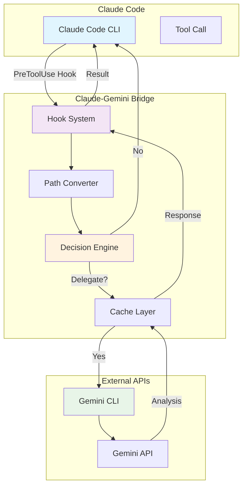
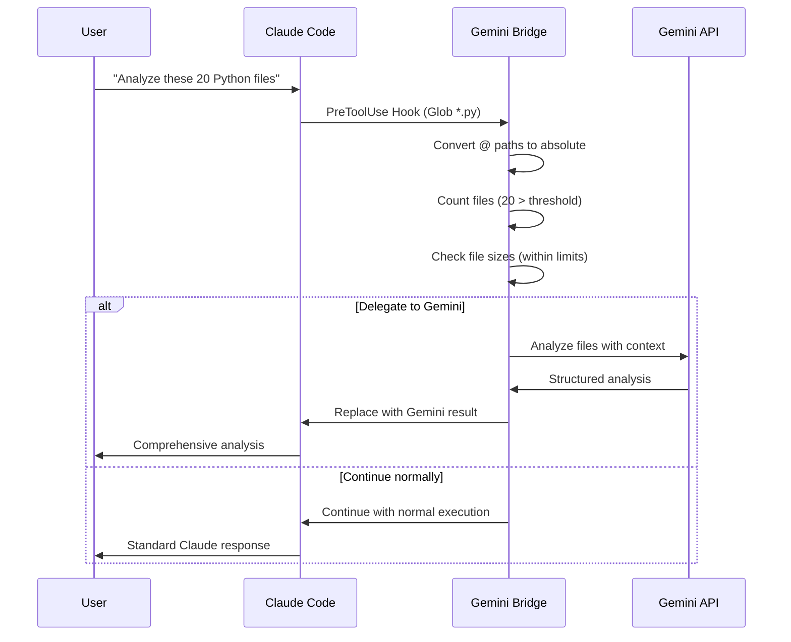
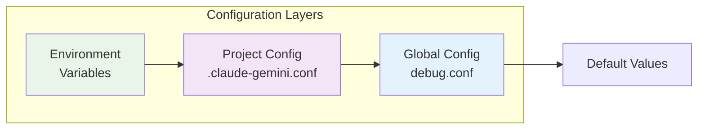
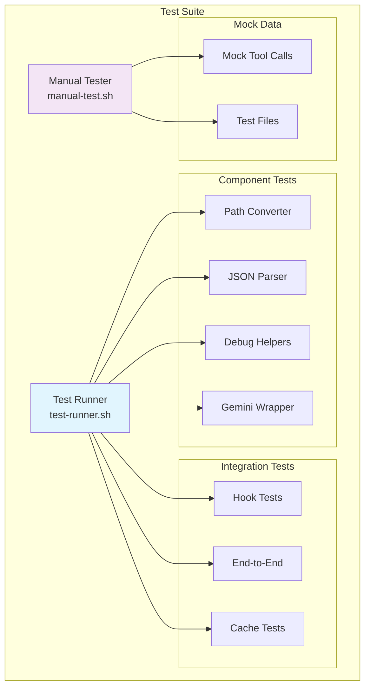
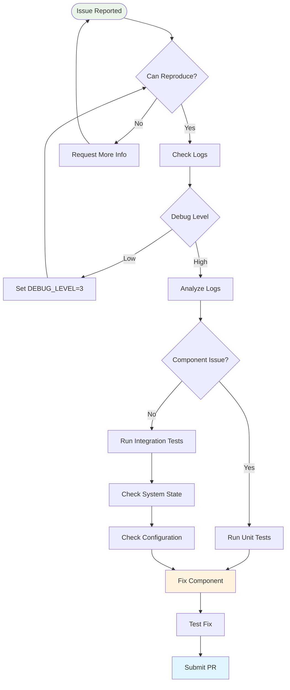
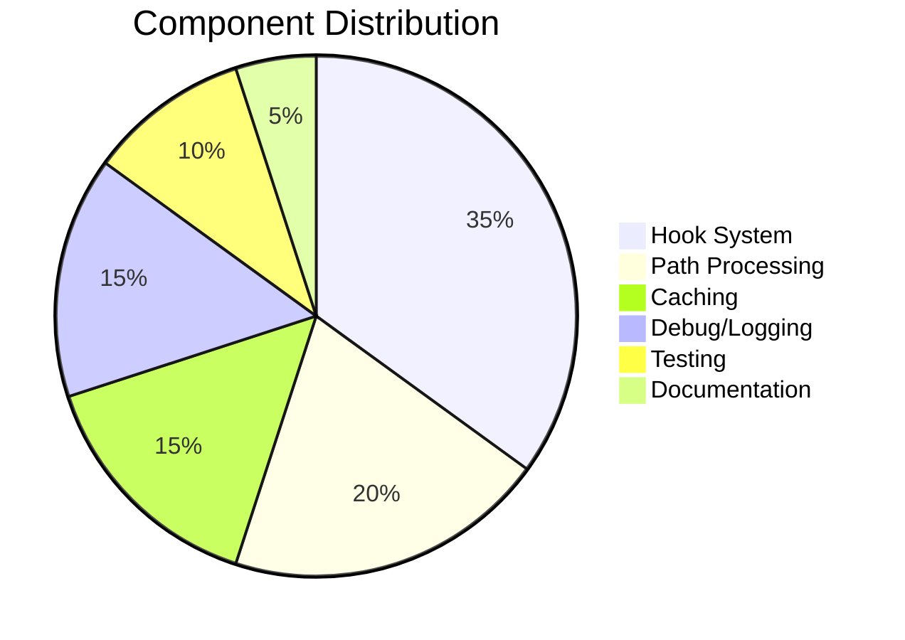

# Claude-Gemini Bridge

🤖 **Intelligent integration between Claude Code and Google Gemini for large-scale code analysis**

The Claude-Gemini Bridge automatically delegates complex code analysis tasks from Claude Code to Google Gemini, combining Claude's reasoning capabilities with Gemini's large context processing power.

[](#testing)
[](#license)
[](#requirements)

## 🚀 Quick Start

```bash
# Install the bridge (default location: ~/.claude-gemini-bridge)
git clone https://github.com/your-username/claude-gemini-bridge.git
cd claude-gemini-bridge
./install.sh

# Test the installation
./test/test-runner.sh

# Use Claude Code normally - large analyses will automatically use Gemini!
claude "analyze all Python files in this project"
```

### Custom Installation Directory

To install to a custom location:

```bash
# Set custom installation directory
export CLAUDE_GEMINI_BRIDGE_DIR="/path/to/your/directory"

# Then install
./install.sh
```

## 📋 Table of Contents

- [Architecture](#-architecture)
- [How It Works](#-how-it-works)
- [Installation](#-installation)
- [Configuration](#-configuration)
- [Usage Examples](#-usage-examples)
- [Testing](#-testing)
- [Troubleshooting](#-troubleshooting)
- [Contributing](#-contributing)

## 🏗️ Architecture



## 🔄 How It Works

The bridge operates through Claude Code's hook system, intelligently deciding when to delegate tasks to Gemini:



### Delegation Criteria

The bridge delegates to Gemini when:

- **File Count**: ≥3 files (configurable)
- **Total Size**: Between 10KB and 10MB
- **Task Type**: Contains keywords like "analyze", "search", "summarize"
- **Tool Type**: Complex Glob patterns, multi-file operations

## 📦 Installation

### Prerequisites

- [Claude Code CLI](https://claude.ai/code) installed and configured
- [Google Gemini CLI](https://github.com/google/generative-ai-cli) installed
- `jq` for JSON processing
- `bash` 4.0+ (macOS: `brew install bash`)

### Automatic Installation

```bash
git clone https://github.com/your-username/claude-gemini-bridge.git
cd claude-gemini-bridge

# Default installation (to ~/.claude-gemini-bridge)
./install.sh

# Or custom location
export CLAUDE_GEMINI_BRIDGE_DIR="/your/custom/path"
./install.sh
```

The installer will:
- ✅ Check all prerequisites
- ✅ Test Gemini connectivity
- ✅ Backup existing Claude settings
- ✅ Configure hooks in `~/.claude/settings.local.json`
- ✅ Set up directory structure and permissions
- ✅ Run validation tests

### Manual Installation

<details>
<summary>Click to expand manual installation steps</summary>

1. **Clone the repository:**
   ```bash
   git clone https://github.com/your-username/claude-gemini-bridge.git
   cd claude-gemini-bridge
   ```

2. **Set up directory structure:**
   ```bash
   mkdir -p ${CLAUDE_GEMINI_BRIDGE_DIR:-~/.claude-gemini-bridge}
   cp -r * ${CLAUDE_GEMINI_BRIDGE_DIR:-~/.claude-gemini-bridge}/
   chmod +x ${CLAUDE_GEMINI_BRIDGE_DIR:-~/.claude-gemini-bridge}/hooks/*.sh
   ```

3. **Configure Claude Code hooks:**
   ```bash
   # Add to ~/.claude/settings.local.json
   {
     "hooks": {
       "PreToolUse": [{
         "matcher": "Read|Grep|Glob|Task",
         "hooks": [{
           "type": "command",
           "command": "${CLAUDE_GEMINI_BRIDGE_DIR:-~/.claude-gemini-bridge}/hooks/gemini-bridge.sh"
         }]
       }]
     }
   }
   ```

</details>

## ⚙️ Configuration

### Basic Configuration

Edit `${CLAUDE_GEMINI_BRIDGE_DIR:-~/.claude-gemini-bridge}/hooks/config/debug.conf`:

```bash
# Delegation thresholds
MIN_FILES_FOR_GEMINI=3              # Minimum files to trigger delegation
MIN_FILE_SIZE_FOR_GEMINI=10240      # Minimum total size (10KB)
MAX_TOTAL_SIZE_FOR_GEMINI=10485760  # Maximum total size (10MB)

# Performance settings
GEMINI_CACHE_TTL=3600               # Cache duration (1 hour)
GEMINI_RATE_LIMIT=1                 # Seconds between API calls
GEMINI_TIMEOUT=30                   # Request timeout

# Debug settings
DEBUG_LEVEL=2                       # 0=off, 1=basic, 2=verbose, 3=trace
CAPTURE_INPUTS=true                 # Save inputs for debugging
DRY_RUN=false                       # Test mode (doesn't call Gemini)
```

### Advanced Configuration



## 💡 Usage Examples

### Basic Usage

Simply use Claude Code normally - the bridge works transparently:

```bash
# These commands will automatically use Gemini for large analyses:
claude "analyze all TypeScript files and identify patterns"
claude "find security issues in @src/ directory" 
claude "summarize the architecture of this codebase"
```

### Project-Specific Configuration

Create `.claude-gemini.conf` in your project root:

```bash
# Disable Gemini for sensitive projects
GEMINI_ENABLED=false

# Custom thresholds for large projects
MIN_FILES_FOR_GEMINI=10
GEMINI_TIMEOUT=60

# Project-specific exclusions
GEMINI_EXCLUDE_PATTERNS="*.secret|*.key|*.env|internal/*"
```

### Debug Mode

```bash
# Enable verbose debugging
echo "DEBUG_LEVEL=3" >> ${CLAUDE_GEMINI_BRIDGE_DIR:-~/.claude-gemini-bridge}/hooks/config/debug.conf

# Test without calling Gemini
echo "DRY_RUN=true" >> ${CLAUDE_GEMINI_BRIDGE_DIR:-~/.claude-gemini-bridge}/hooks/config/debug.conf

# View live logs
tail -f ${CLAUDE_GEMINI_BRIDGE_DIR:-~/.claude-gemini-bridge}/logs/debug/$(date +%Y%m%d).log
```

## 🧪 Testing

### Automated Testing

```bash
# Run full test suite
${CLAUDE_GEMINI_BRIDGE_DIR:-~/.claude-gemini-bridge}/test/test-runner.sh

# Test individual components
${CLAUDE_GEMINI_BRIDGE_DIR:-~/.claude-gemini-bridge}/hooks/lib/path-converter.sh
${CLAUDE_GEMINI_BRIDGE_DIR:-~/.claude-gemini-bridge}/hooks/lib/json-parser.sh
${CLAUDE_GEMINI_BRIDGE_DIR:-~/.claude-gemini-bridge}/hooks/lib/gemini-wrapper.sh
```

### Interactive Testing

```bash
# Interactive test tool
${CLAUDE_GEMINI_BRIDGE_DIR:-~/.claude-gemini-bridge}/test/manual-test.sh
```

The interactive tester provides:
- 🔍 Mock tool call testing
- 📝 Custom JSON input testing  
- 🔄 Replay captured calls
- 📊 Log analysis
- 🧹 Cache management

### Test Architecture



## 🐛 Troubleshooting

### Common Issues

<details>
<summary><strong>Hook not executing</strong></summary>

**Symptoms:** Claude behaves normally, Gemini never called

**Solutions:**
```bash
# Check hook configuration
cat ~/.claude/settings.local.json | jq '.hooks'

# Test hook manually
echo '{"tool":"Read","parameters":{"file_path":"test.txt"},"context":{}}' | \
  ${CLAUDE_GEMINI_BRIDGE_DIR:-~/.claude-gemini-bridge}/hooks/gemini-bridge.sh

# Verify file permissions
ls -la ${CLAUDE_GEMINI_BRIDGE_DIR:-~/.claude-gemini-bridge}/hooks/gemini-bridge.sh
```
</details>

<details>
<summary><strong>Gemini API errors</strong></summary>

**Symptoms:** "Gemini initialization failed" errors

**Solutions:**
```bash
# Test Gemini CLI directly
echo "test" | gemini -p "Say hello"

# Check API key
echo $GEMINI_API_KEY

# Verify rate limits
grep -i "rate limit" ${CLAUDE_GEMINI_BRIDGE_DIR:-~/.claude-gemini-bridge}/logs/debug/*.log
```
</details>

<details>
<summary><strong>Cache issues</strong></summary>

**Symptoms:** Outdated responses, cache errors

**Solutions:**
```bash
# Clear cache
rm -rf ${CLAUDE_GEMINI_BRIDGE_DIR:-~/.claude-gemini-bridge}/cache/gemini/*

# Check cache settings
grep CACHE ${CLAUDE_GEMINI_BRIDGE_DIR:-~/.claude-gemini-bridge}/hooks/config/debug.conf

# Monitor cache usage
du -sh ${CLAUDE_GEMINI_BRIDGE_DIR:-~/.claude-gemini-bridge}/cache/
```
</details>

### Debug Workflow



## 🤝 Contributing

We welcome contributions! Please see our [Contributing Guidelines](CONTRIBUTING.md) for details.

### Development Setup

```bash
# Fork and clone
git clone https://github.com/your-username/claude-gemini-bridge.git
cd claude-gemini-bridge

# Install development dependencies
brew install shellcheck shfmt

# Set up pre-commit hooks
./scripts/setup-dev.sh

# Run tests before committing
./test/test-runner.sh
```

### Code Standards

- **Shell Scripts**: Follow [Google Shell Style Guide](https://google.github.io/styleguide/shellguide.html)
- **Comments**: English only, include ABOUTME headers
- **Testing**: All functions must have unit tests
- **Documentation**: Update README for any API changes

## 📄 License

This project is licensed under the MIT License - see the [LICENSE](LICENSE) file for details.

## 🙏 Acknowledgments

- **Inspired by**: Reddit user's implementation of Claude-Gemini integration
- **Claude Code Team**: For the excellent hook system
- **Google**: For the Gemini API and CLI tools
- **Community**: For testing and feedback

## 📊 Project Stats



---

<div align="center">

**Made with ❤️ for the Claude Code community**

[Report Bug](https://github.com/your-username/claude-gemini-bridge/issues) • 
[Request Feature](https://github.com/your-username/claude-gemini-bridge/issues) • 
[View Documentation](./docs/)

</div>